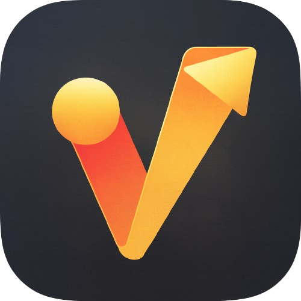

# VideoSnatcher
VideoSnatcher by JEMcats-Software allows for you to download videos from Youtube and similer platforms.

## To-Do List
- [ ] Audio Extraction For Video Only Instances
- [ ] Fix The Problems Of Youtube Outputs (m4a's work best)
- [ ] Add Dark Mode
- [ ] Add Windows Support
- [ ] Add Download Progress Bar
- [ ] Add Website
- [ ] Write Documentation
- [ ] Launch v1.0.0-beta

## Requirements
You MUST have Rosetta installed if you are on a Mac with Apple Silicon. To do so please run this command in terminal.
```
/usr/sbin/softwareupdate --install-rosetta
```

## Support
For questions open a discussion.

For support, reports, or requests open an issue.

## Contributing
Fork the ``dev`` branch.

Make your changes in your fork.

Fill out the pull request form.

Open a pull request.

## License
This project is licensed under the GPL-3.0 license.

You may:
- Modify and redistribute the code,
- Only if you keep it open-source and GPL-licensed,
- Provide credit to the original author (JEMcats-Software).

No closed-source forks or redistributions allowed.

## Credits

- [YT-DLP](https://github.com/yt-dlp/yt-dlp) (The runtime that make this possible)
- [FFMPEG](https://github.com/FFmpeg/FFmpeg) (Combines video and audio + extracts audio)